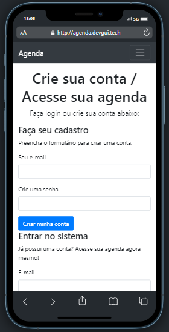
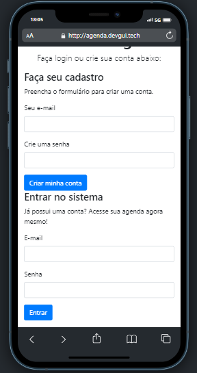
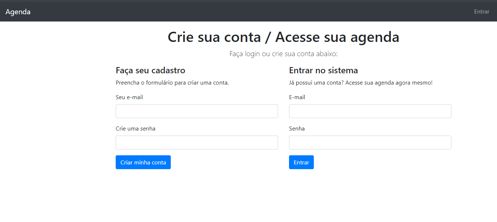
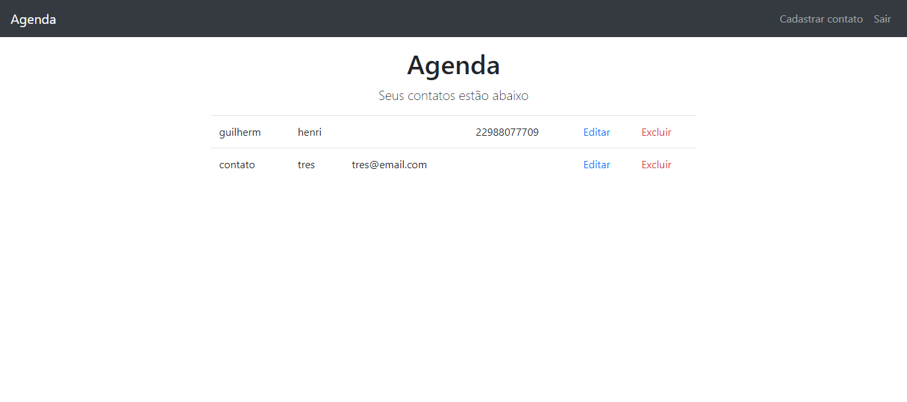
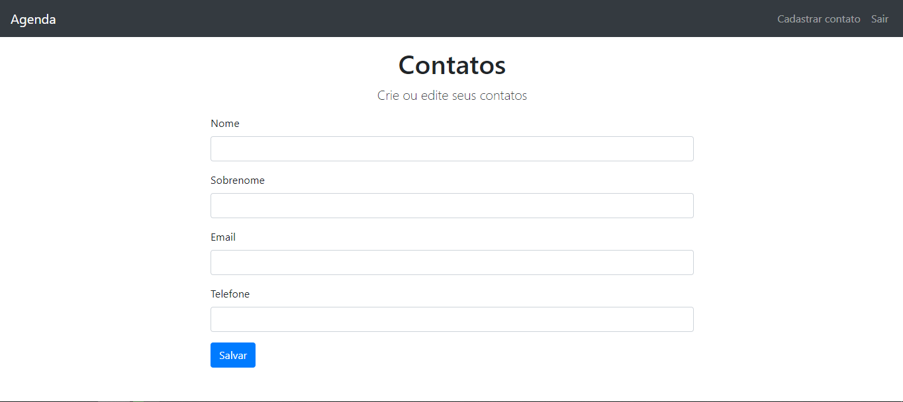

# Agenda de contatos
[](https://github.com/GuilhermeHenrii/Projeto-Agenda/blob/main/LICENSE) 

# Sobre o projeto

Esse projeto tem como objetivo ajudar você a organizar seus contatos, sem precisar de papel e caneta, tudo direto da sua tela.

Técnicamente falando, esse é um projeto server-side rendered (SSR), ou seja, eu não usei JavaScript no lado do cliente para a renderização da página, exceto para a validação de formulálrios, para evitar a sobrecarga no servidor. Usei o view engine EJS para a renderização do HTML da página imbutido com o JavaScript.

Criei um sistema de criação de usuário, com email e senha. Com o usuário criado, o mesmo já pode logar na aplicação. Além das validações no frontEnd, usei as flash messages para renderizar os erros do servidor.

Cada usuário tem sua agenda, com seus respectivos contatos. Usei o mongoDB para a modelagem e armazenamento dos dados.

Foi muito interessante trabalhar com uma server-side rendered, gostei muito do jeito como a modelagem com o mongoDB é simples e intuitiva. Posso testacar também a lib CSRF, para uma maior segurança nos formulários, junto com o campo do tipo hidden.

## Layout mobile
 

## Layout web





# Tecnologias utilizadas
## Back end
- NodeJS
- EJS
- MongoDB
- Flash Mensages
## Front end
- HTML / CSS / JS

# Como executar o projeto

## Back end
Pré-requisitos: NodeJS, npm.

```bash
# clonar repositório
git clone https://github.com/GuilhermeHenrii/Projeto-Agenda.git

# entrar na pasta do projeto back end
cd prijeto-agenda

# executar o projeto
npm run start
```

# Autor

Guilherme Henrique da Silva Lopes

https://www.linkedin.com/in/guilherme-henrique-7aab6b229/